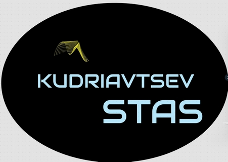
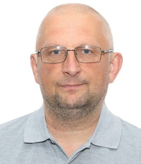

# Frontend Developer / *Stanislav Kudriavtsev*/
## :bookmark: Summary
&nbsp;&nbsp;&nbsp;&nbsp;Mission-driven Frontend developer with a passion for thoughtful UI design and collaboration.  
Proficient in an assortment of technologies, including JavaScript, React, Redux,  NodeJS. Able to effectively self-manage during independent projects, as well as collaborate in a team setting.  
Fan of unit tests, functional programming and typed interfaces.

## :telephone_receiver: Contacts

|  |        |
| :--------------: | :-------------------------------------------------------------------- |   
|  |                                                        |
| :thumbsup: linkedIn        |	[stanislav-frontend](https://www.linkedin.com/in/stanislav-frontend/) |                                      
| :mailbox: email           |	stas.webdev@yahoo.com                                                 |                        
| :octocat: github          |	[stas-webdeveloper](https://github.com/stas-webdeveloper)             |                                              
| :thumbsup: discord         |	:)Stas (@stas-webdeveloper)                                                             |
-----
## :loop: Skills
* HTML5 & CSS3
* JavaScript >ES6
* TypeScript
* React
* Redux
* NodeJS (basics)
* Git
* Webpack

## :computer: Code Example
-----
## :office: Experience

Freelance, Kaliningrad — Frontend Developer  
*Jan  2019 - PRESENT*, https://mysite.com
* TASKS
    * Worked with honesty and integrity every step of the way.
    * Performed thorough research for planning purposes
    * Worked well independently
    * Fully engaged with team members to achieve the highest levels of productivity.
* ACCOMPLISHMENTS
    * Dramatically increased speed of UI development using atomic, scalable CSS
    * Improved accuracy, coverage, and speed of automated tests.

## :blue_book: Education
* Higher education
  * Highest Military Command Communication College, Location — Oryol, Russia  
  *Aug 1984 - Aug 1988*  
  Engineer for the operation of radio and electrical conductive communications
  * Online learning  
  Glo Academy  
  *Aug 2018 - Dec 2018*  
  HTML/ CSS/ JS Basics
-----
# Languages:

   * :ru: Russian - native speaker  
   * :uk: English - A2 (B1 in process…)  
  + StreamLine Language School English test result: Pre-Intermediate (CEFR A2+). 
https://test.str.by/mod/quiz/view.php?id=1176
  + EPAM English test result: A1 I try to learn English in every possible way. I use application in smartphone: Duolingo and I use google translate a lot. 
https://examinator.epam.com/Main/PersonalAssignments
  + EFset Logo 
  www.efset.org)
